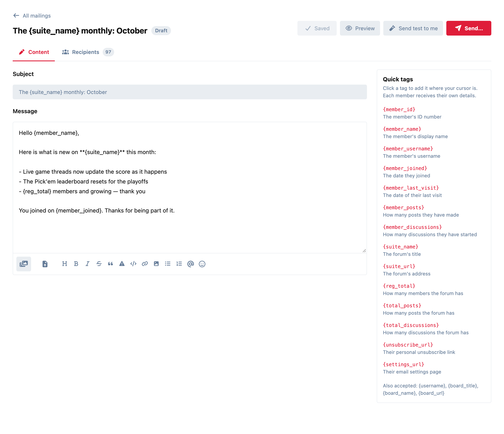
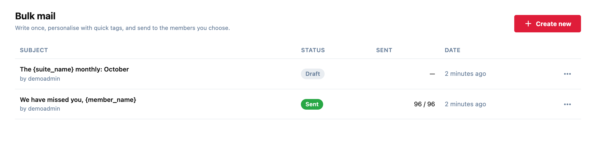
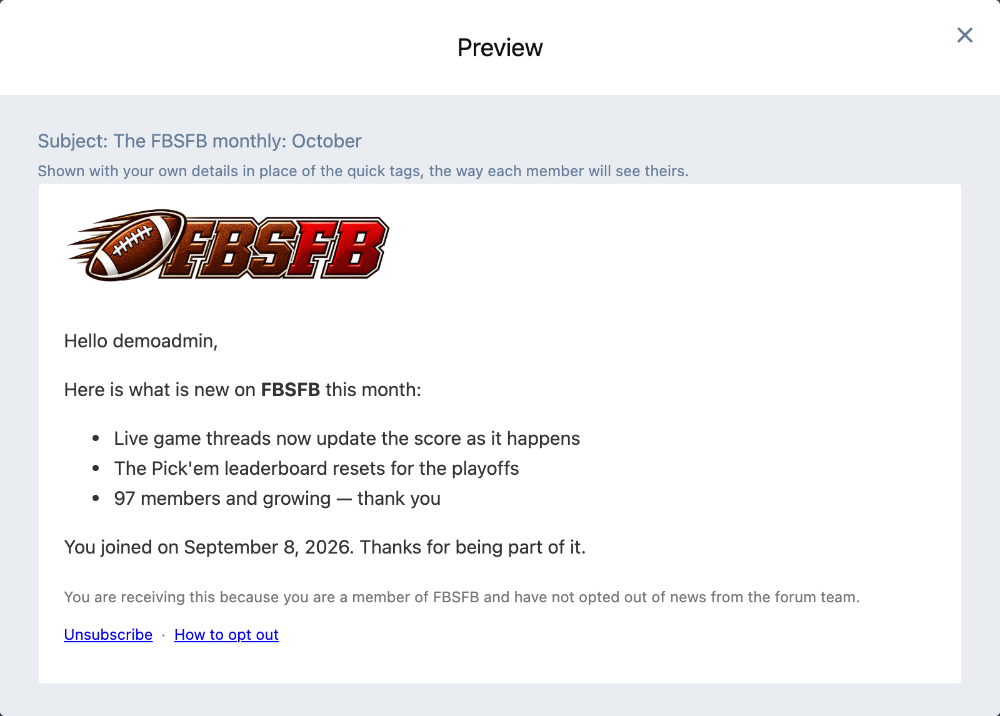
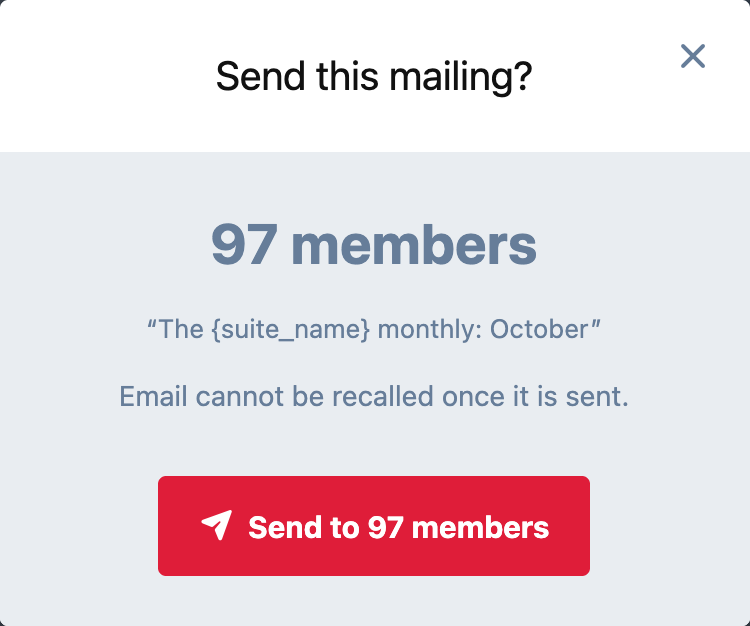
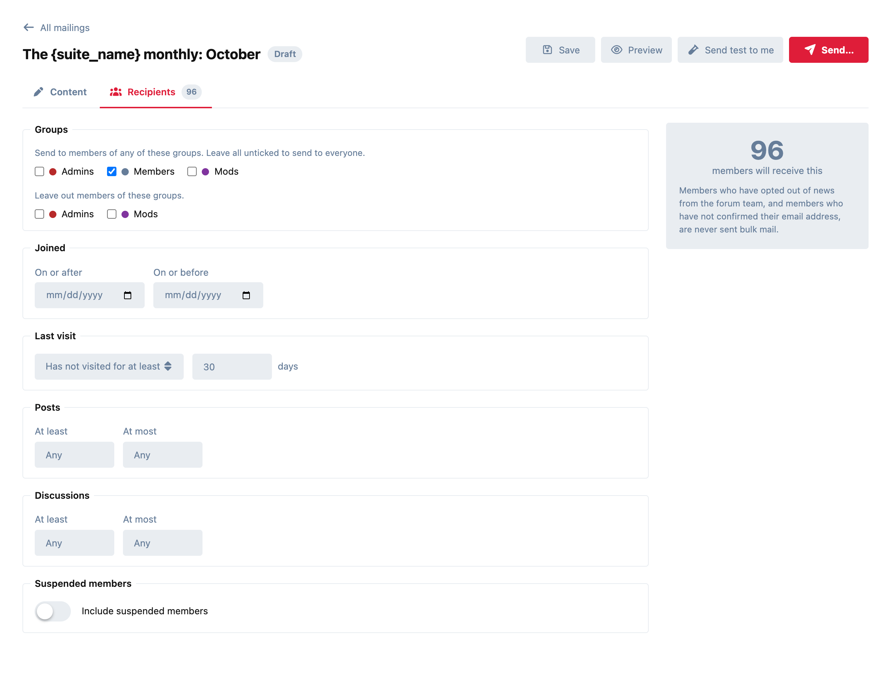
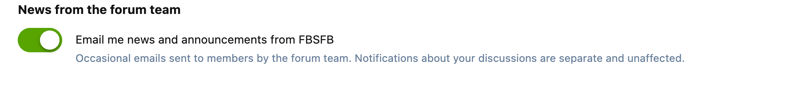
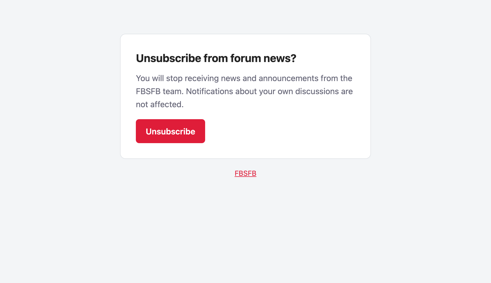

# Herald

**Bulk email for Flarum, the way Invision Community does it.**

Write one message in your forum's own editor. Drop in quick tags like
`{member_name}` and `{suite_name}`, choose who gets it, preview it as a member
will see it, and send. Every member gets their own copy with their own name,
join date and post count filled in, sent in the background, in batches your
mail provider can cope with.

[](https://flarum.org)
[](LICENSE)
[](https://www.php.net)



---

## Contents

- [What you get](#what-you-get)
- [Installation](#installation)
- [Writing and sending a mailing](#writing-and-sending-a-mailing)
- [Quick tags](#quick-tags)
- [Choosing recipients](#choosing-recipients)
- [Consent and unsubscribing](#consent-and-unsubscribing)
- [How sending works](#how-sending-works)
- [Works with your editor](#works-with-your-editor)
- [Settings](#settings)
- [Permissions](#permissions)
- [What the email looks like](#what-the-email-looks-like)
- [For developers: adding tags and filters](#for-developers-adding-tags-and-filters)
- [Troubleshooting](#troubleshooting)
- [Requirements](#requirements)
- [Licence](#licence)

---

## What you get

If you have used **ACP → Members → Bulk Mail** in Invision Community, you
already know how Herald works. It follows the same model and uses the same tag
names.

- **A list of every mailing**, with its status (draft, sending, sent,
  cancelled), how many it reached and when. Each one can be edited, previewed,
  copied, sent again or deleted.
- **Your forum's own editor.** Markdown, FoF Rich Text or Scribe: whatever your
  members write posts with, you write mailings with, toolbar and all.
- **Quick tags**, clicked into place from a panel beside the editor, in the
  subject line or the message.
- **Recipient filters:** groups to include or leave out, join date, last visit,
  post and discussion counts, suspended members. A live count updates as you
  change them.
- **Preview as yourself.** The email exactly as it will arrive, with your own
  details where the tags are.
- **Send a test to yourself** before anyone else sees it.
- **A count before the button.** The last step says how many people the email
  is about to reach, because an email cannot be recalled.
- **Background sending in batches**, with a progress bar and a Cancel button.
  It works on any host: with a queue worker, with cron, or with neither.
- **One-click unsubscribe** in every email, including the `List-Unsubscribe`
  headers that Gmail and Yahoo now require from bulk senders.
- **A switch on each member's Settings page** to opt out of, or back in to,
  news from the forum team.
- **Fully translatable.** Every word on screen and in the email comes from the
  locale file.



## Installation

```bash
composer require ernestdefoe/herald
php flarum migrate
php flarum cache:clear
```

Enable **Herald** in the admin panel. Then open **Bulk mail** from your avatar
menu, or use the **Open Herald** button on the extension's settings page.

### Updating

```bash
composer update ernestdefoe/herald
php flarum migrate
php flarum cache:clear
```

### Before your first real mailing

1. **Check your forum's mail settings.** Send yourself a test from
   **Admin → Email** first. Herald sends through the same mailer as every other
   email your forum sends.
2. **Make sure sending can continue in the background.** See
   [How sending works](#how-sending-works). Without a queue worker or cron, the
   progress page has to stay open until the send finishes.

## Writing and sending a mailing

1. **Bulk mail → Create new.**
2. **Content tab:** write a subject and a message. Click any quick tag to insert
   it where your cursor is, in either field.
3. **Recipients tab:** narrow down who gets it. The count on the right updates
   as you go.
4. **Preview** to see the finished email with your own details filled in.
5. **Send test to me** to check it in a real inbox.
6. **Send…** shows how many members it will reach. Confirm, and it starts
   sending.

A mailing can be sent again later. **Send again…** goes to everyone who matches
the filters at that moment, the way Invision's resend does. **Copy** makes a new
draft from an existing mailing, for anything you send regularly.

| Preview | Confirm |
| --- | --- |
|  |  |

## Quick tags

Tags are written in braces. They work in the **subject** and the **message**,
including inside link addresses: `[your profile]({suite_url}/u/{member_username})`
becomes a working link to each member's own profile.

The names are Invision's, so an admin moving from IPS types what they already
know.

### Member tags

| Tag | Becomes |
| --- | --- |
| `{member_id}` | The member's ID number |
| `{member_name}` | Their display name |
| `{member_username}` | Their username |
| `{member_joined}` | The date they joined, in their own language (`2. Oktober 2026` for a German member) |
| `{member_last_visit}` | The date of their last visit |
| `{member_posts}` | How many posts they have made |
| `{member_discussions}` | How many discussions they have started |

### Forum tags

| Tag | Becomes |
| --- | --- |
| `{suite_name}` | The forum's title |
| `{suite_url}` | The forum's address |
| `{reg_total}` | How many members the forum has |
| `{total_posts}` | How many posts the forum has |
| `{total_discussions}` | How many discussions the forum has |

### Link tags

| Tag | Becomes |
| --- | --- |
| `{unsubscribe_url}` | Their personal one-click unsubscribe link |
| `{settings_url}` | Their account settings page |

Every email already ends with both links in its footer, so you only need these
if you want them in the body as well.

### Aliases

These friendlier names also work:

| Alias | Same as |
| --- | --- |
| `{username}` | `{member_name}` |
| `{board_title}`, `{board_name}` | `{suite_name}` |
| `{board_url}` | `{suite_url}` |

Invision also has "most users ever online" tags. Flarum keeps no such record, so
Herald leaves them out rather than ship tags that always print zero.

Values are escaped for where they appear. A member whose display name contains
`<` or `&` gets it shown as text, never as markup. A tag that is not recognised
is left exactly as written.

## Choosing recipients



Every filter you set narrows the list further. Filters left empty do nothing.

| Filter | What it does |
| --- | --- |
| **Groups: send to** | Members of *any* of the ticked groups. Tick none to send to everyone. Ticking **Members** also means everyone. |
| **Groups: leave out** | Excludes anyone in a ticked group. |
| **Joined** | On or after, and/or on or before, a date. |
| **Last visit** | *Visited within the last N days* (your active members) or *has not visited for at least N days* (the "we've missed you" mailing). Members who have never visited count as not having visited. |
| **Posts** | At least and/or at most N posts. |
| **Discussions** | At least and/or at most N discussions started. |
| **Suspended members** | Left out unless you switch this on. Only shown when flarum/suspend is enabled. |

Two rules apply to every mailing and **cannot be switched off**:

- **Members who have opted out are never sent bulk mail.**
- **Members who have not confirmed their email address are never sent bulk
  mail.**

The count shows how many members each rule excluded, so the number is never a
surprise.

A send also includes only members who existed when you pressed **Send**.
Someone who registers halfway through a large send is not added to it.

## Consent and unsubscribing

**Members are opted in by default,** as in Invision Community, and every email
says plainly how to opt out.

Herald keeps its own consent flag. Agreeing to hear about replies to your
discussions is not the same as agreeing to a mailing list, so turning off
Herald's emails does not affect a member's notification settings, and the
reverse is true too.

Members can opt out in three ways:

1. **The Unsubscribe link** at the foot of every email. No sign-in is needed.
   The link opens a page that asks first, so mail scanners that open every link
   in a message do not unsubscribe anyone by accident.
2. **One-click unsubscribe in their mail app.** Every email carries
   `List-Unsubscribe` and `List-Unsubscribe-Post` headers
   ([RFC 8058](https://www.rfc-editor.org/rfc/rfc8058)). Gmail, Yahoo and
   Apple Mail show their own Unsubscribe button. Since 2024, Gmail and Yahoo
   expect these headers from bulk senders and may send mail without them to
   spam.
3. **Their Settings page**, under *News from the forum team*. This is also where
   to opt back in.



The unsubscribe page uses your forum's title and brand colour, works in light
and dark mode, and offers a **Resubscribe** button in case someone clicked by
mistake.



Unsubscribe links are signed with a secret generated on your forum. A link
stops working if the member changes their email address, so an old email cannot
change the preferences of an address it was never sent to.

## How sending works

An email cannot be recalled, and sending thousands of them inside one web
request is how a send dies halfway with no record of who got it. So Herald
sends **in batches**, recording its progress after every single email.

Three things can push a send along, and Herald uses whichever your forum has:

| Driver | When it runs |
| --- | --- |
| **The progress page** | Whenever the page is open in an admin's browser. It sends one batch per request, like Invision's progress screen. This works on any host, with nothing to set up. |
| **The queue** | If your forum runs a queue worker (Redis, database, Horizon). The send continues after you close the page. |
| **The scheduler** | If cron runs Flarum's scheduler. Herald sends batches every minute until it's done. |

All three can run at once without harm. Each batch is taken with a lock, so two
of them never send the same batch or mail the same member twice.

If neither a queue nor cron is set up, the progress page tells you to keep it
open. To let sends carry on without it, add Flarum's scheduler to cron. This is
worth doing for Flarum in general:

```
* * * * * cd /path/to/flarum && php flarum schedule:run >> /dev/null 2>&1
```

You can also push a send along by hand:

```bash
php flarum herald:process
```

**Cancel sending** stops at the next member, not the next batch. Members who
already received it keep their copy, and the mailing is marked *Cancelled* with
the count it reached.

A failed email (a rejected address, a provider hiccup) is counted, logged with
the reason, and skipped. It does not stop the rest of the send.

## Works with your editor

Herald does not have an editor of its own. It uses your forum's editor:

| Your forum runs | You write mailings in |
| --- | --- |
| **flarum/markdown** | The Markdown editor and its formatting toolbar |
| **[FoF Rich Text](https://github.com/FriendsOfFlarum/rich-text)** | The rich text editor |
| **[Scribe](https://github.com/ernestdefoe/scribe)** | Scribe's WYSIWYG editor and toolbar |

Mentions, emoji, and upload buttons from extensions such as FoF Upload all work
as they do in the composer.

**Why the mailing screen is on the forum, not in the admin panel.** Rich editors
install themselves into the forum's interface only, and the admin panel never
loads them. A compose screen in the admin panel would quietly give every forum a
plain text box. Herald's screens live at `/herald` on the forum, behind their
own permission.

Mailings are stored the way posts are, so **switching editors later is safe**.
A mailing written in Markdown still previews and sends correctly after you move
to Scribe or Rich Text.

## Settings

**Admin → Herald**

| Setting | Default | What it does |
| --- | --- | --- |
| **Emails per batch** | 50 | How many emails each batch sends. Lower it if your mail provider limits how fast you can send. |
| **Seconds between batches** | 0 | A pause between batches, for providers with an hourly cap. For example, 50 per batch every 60 seconds is 3,000 an hour. |
| **Reply-to address** | *(empty)* | Where replies to a mailing go. Empty uses your forum's normal sending address. |

The sender name and address are your forum's own, set in **Admin → Email**.

## Permissions

**Admin → Permissions → Moderate → Send bulk email with Herald.**

Administrators always have it. Give it to another group only if you trust them
to email your whole membership. Members without it don't see the menu item, and
the API refuses them.

## What the email looks like

Herald wraps your message in Flarum's own email layout, with your forum's logo
at the top, so it looks like every other email your forum sends. On top of
that, Herald:

- **makes every link absolute,** so mentions, uploads and internal links work
  from an inbox;
- **turns embeds into links,** because email clients strip video players and
  iframes;
- **removes scripts and event handlers;**
- **inlines its styles,** because several mail clients drop `<style>` blocks;
- **caps the logo's size,** so a wide logo cannot push the email off-screen;
- **adds a plain-text part,** with links written out as `text (address)`;
- **translates the footer into each member's own language.** The message is
  yours, in whatever language you wrote it.

If your forum is set to send plain-text or HTML-only email, Herald follows that
setting.

## For developers: adding tags and filters

Herald has the same extension points as Invision's BulkMail and MemberFilter.
Other extensions can add **quick tags** and **recipient filters**.

Register them with Herald's extender. Wrap it in `Conditional` so your extension
still boots on forums without Herald:

```php
use Flarum\Extend;

return [
    (new Extend\Conditional())
        ->whenExtensionEnabled('ernestdefoe-herald', fn () => [
            (new \ErnestDefoe\Herald\Extend\Herald())
                ->tags(PickemTags::class)
                ->filter(PickemPlayersFilter::class),
        ]),
];
```

### A tag provider

```php
use ErnestDefoe\Herald\Tag\TagProvider;
use Illuminate\Support\Collection;

class PickemTags implements TagProvider
{
    public function tags(): array
    {
        // name (no braces) => translation key for its description
        return ['pickem_rank' => 'acme-pickem.herald.tag_rank'];
    }

    public function urlTags(): array
    {
        // Tags whose value is a URL, so they work inside a link's address.
        return [];
    }

    public function values(Collection $users): array
    {
        // 🚨 You are handed a whole BATCH of members. Query once for all of
        // them, not once per member.
        $ranks = Rank::query()->whereIn('user_id', $users->pluck('id'))->pluck('rank', 'user_id');

        return $users->mapWithKeys(fn ($user) => [
            $user->id => ['pickem_rank' => (string) ($ranks[$user->id] ?? '–')],
        ])->all();
    }
}
```

Return **plain text**. Herald escapes values for wherever the tag appears.

### A recipient filter

```php
use ErnestDefoe\Herald\Filter\Filter;
use Illuminate\Database\Eloquent\Builder;

class PickemPlayersFilter implements Filter
{
    public function key(): string
    {
        return 'pickem';
    }

    public function apply(Builder $query, array $config): void
    {
        if (empty($config['playersOnly'])) {
            return; // nothing set: leave the query alone
        }

        // 🚨 Qualify every column. Another filter may have joined a table
        // with a column of the same name.
        $query->whereExists(fn ($q) => $q->selectRaw('1')
            ->from('pickem_entries')
            ->whereColumn('pickem_entries.user_id', 'users.id'));
    }
}
```

A filter's settings are saved in the mailing under its `key()`.

### Its controls on the Recipients tab

The Recipients tab is an `ItemList`, so you can add your controls next to the
built-in ones. Write into `this.section('<your key>')` and call
`this.attrs.onchange()`, which saves the change and refreshes the count:

```js
import { extend } from 'flarum/common/extend';
import Switch from 'flarum/common/components/Switch';
import RecipientFilters from 'ext:ernestdefoe/herald/forum/components/RecipientFilters';

extend(RecipientFilters.prototype, 'items', function (items) {
  const config = this.section('pickem');

  items.add(
    'pickem',
    <fieldset className="HeraldFilter">
      <legend>Pick'em</legend>
      <Switch
        state={!!config.playersOnly}
        onchange={(value) => {
          config.playersOnly = value;
          this.attrs.onchange();
        }}
      >
        Only members who have made picks
      </Switch>
    </fieldset>,
    55
  );
});
```

Add `useExtensions: ['ernestdefoe/herald']` to your `webpack.config.js`, and
list Herald under `optional-dependencies` in `composer.json`, so the bundle
loads in the right order.

## Troubleshooting

**The progress bar does not move after I close the page.**
Your forum has neither a queue worker nor cron running the scheduler. Reopen the
mailing and the page will carry on sending, or set up cron as shown in
[How sending works](#how-sending-works).

**Every email in a mailing failed.**
Herald counts the failures and logs the reason for each in
`storage/logs/flarum-<date>.log`, under `[herald]`. Most often the forum's mail
settings are wrong. Send yourself a test from **Admin → Email**.

**The count is lower than my number of members.**
Opted-out and unconfirmed members are never included, and suspended members are
left out unless you include them. The count shows how many were left out for
each reason.

**A tag came through as text, such as `{member_nmae}`.**
It is misspelled, so Herald left it alone. Click tags in from the Quick Tags
panel to avoid typos.

**Links to my own forum show "nofollow".**
That comes from the forum's link handling for posts and has no effect in an
email.

## Requirements

- Flarum **2.0** or later
- PHP **8.3** or later
- A working mail configuration in **Admin → Email**

## Licence

MIT. See [LICENSE](LICENSE).

Herald is free. If it saves you an afternoon, a star on GitHub helps other
forum owners find it.
